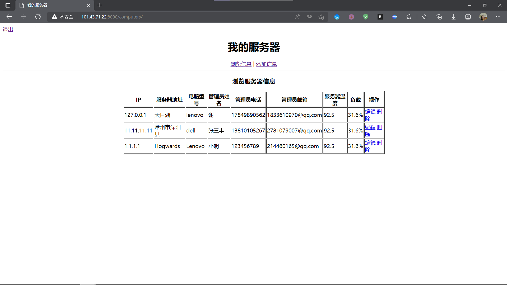
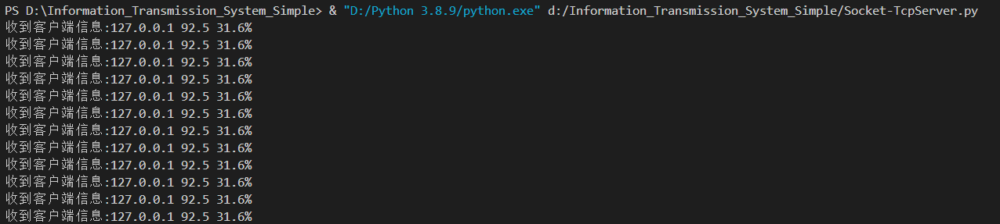
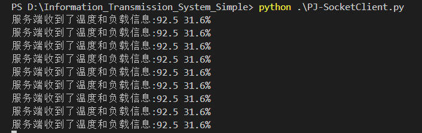

# Information_Transmission_System_Simple
A simpla project 'information transmission_system' for NUAA 'Free Exploration Plan' with college freshman. The project deals the problem of monitoring CPU temperature and sending alarm message. Code with MySQL database and Django web frame. Code language is Python of main. It's theme focus on 'Socket' and 'Internet Communication'.
Because of the overtime of the cloud server, now it can run in local. To run the project, ensure the local MySQL database and Python environment is correct, update the relevant settings of Django and migrate for databases before running it. Some information about Django you should know by yourself.
Web run : cd '/webb' and terminal input 'python manage.py runserver'(Windows) or 'python3 manage.py runserver'(Linux).
Socket run : run 'PJ-SocketServer.py', then run 'PJ-SocketClient.py'.

